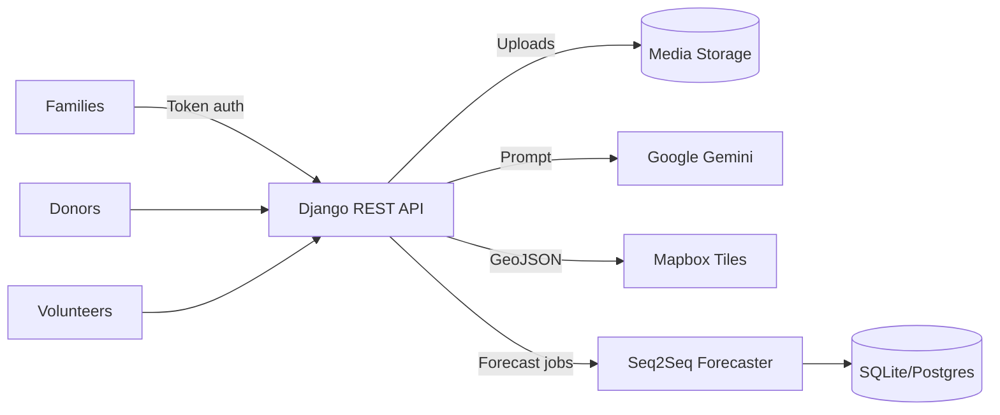

# FreshBay Community Assistance Platform (CAC)

FreshBay CAC orchestrates surplus food recovery across donors, volunteers, and families. It combines a Django REST API, an Expo/React Native client, and a PyTorch forecasting engine to predict future demand and streamline logistics.

## Mission & Impact
- Reduce food waste while improving food access across Congressional District 118 zones.
- Provide operational visibility to donor logistics teams and volunteer coordinators.
- Deliver AI-assisted insights (forecasting + image analysis) to keep inventory fresh and allocations equitable.

## Roles
- **Families** tap into live donation feeds, reserve items, and receive aid recommendations.
- **Donors** publish surplus items, configure pickup capacity, and track impact metrics.
- **Volunteers** accept optimized routes, log status updates, and measure performance badges.
- **Coordinators** oversee dashboards, approve inspections, and trigger forecast refreshes.

## Architecture Overview
- **Backend:** Django 5.2, Django REST Framework, token authentication, Jazzmin admin UI, SQLite (dev) / Postgres ready.
- **Mobile/Web:** Expo Router (React Native 0.81), Mapbox GL for geospatial layers, themable UI components.
- **ML & Analytics:** PyTorch seq2seq forecaster using Feeding America metrics, Pandas preprocessing, scikit-learn scalers.
- **AI Integrations:** Google Gemini 2.5 Flash for food inspection JSON analysis, USDA agritourism API fallback data.
- **Ops:** SMTP notifications, environment-driven configuration, optional pillow-heif for HEIC uploads.



## Key Backend Modules
- `app/models.py`: Custom `User` manager, donation lifecycle, volunteer tasks, forecasts, inspections.
- `app/views.py`: Role-aware dashboards, reservation endpoints, donor analytics, volunteer routes, agritourism search.
- `app/serializers.py`: API serializers for each domain model, including forecast and inspection payloads.
- `app/utils.py`: Role normalization, Gemini prompt + parsing helpers.
- `app/ml/seq2seq_food_insecurity.py`: ForecastConfig dataclass, dataset loaders, encoder-decoder PyTorch model.
- `app/management/commands/seed_sample_data.py`: Seeds demo donors, volunteers, zones, and donations.

## API Surface (Highlights)
- `POST /login/` → token issuance, `GET /me/` → authenticated profile with role.
- Families: `GET /families/available/`, `POST /families/reserve/`, `GET /families/claims/`, `GET /families/aid/`.
- Donors: `GET /donors/dashboard/`, `POST /donors/donations/`, `POST /donors/auto-route/`, `PATCH /donors/claims/<id>/`.
- Volunteers: `GET /volunteers/tasks/`, `POST /volunteers/tasks/accept/`, `POST /volunteers/tasks/status/`.
- Food inspections: `POST /food-inspections/` (multipart image upload), `GET /food-inspections/<id>/`.
- Forecast dashboards: `GET /dashboards/food-security/` and `/dashboards/food-security/page/`.

## Forecasting Workflow
1. Load Feeding America dataset via Pandas (percent columns normalized, categorical encoding for states).
2. Build time series sequences per district (`history_len=6`, `horizon=3`).
3. Train seq2seq model with attention, dropout, teacher forcing, and weighted loss.
4. Save checkpoints (`best_seq2seq_model.pth`) and export predictions (`predictions_per_district.csv`).
5. Refresh `FoodInsecurityForecast` entries to power dashboards and donor smart suggestions.

## Food Inspection Pipeline
- Upload images stored using `food_inspection_upload_path` timestamped convention.
- Gemini prompt demands strict JSON with `food_type`, `food_item`, `freshness_rating`, `expiry_date` (each includes confidence score).
- Parses response into `FoodInspection.analysis`; errors flagged with human-readable message.

## Setup Checklist
1. `python3 -m venv .venv && source .venv/bin/activate`.
2. `pip install -r backend/requirements.txt` (or install listed packages manually).
3. Create `backend/.env` with `DJANGO_SECRET_KEY`, `MAPBOX_ACCESS_TOKEN`, `GOOGLE_API_KEY`, SMTP credentials.
4. `cd backend && python manage.py migrate && python manage.py seed_sample_data && python manage.py runserver`.
5. `cd ../CAC-App && npm install && npm run start` (scan QR with Expo Go or run simulator).

## Forecasting Spotlight: LSTM-Powered Food Insecurity Insights
Our forecasting engine leverages a custom LSTM encoder-decoder architecture designed to model longitudinal hunger trends across U.S. counties. The pipeline blends USDA Economic Research Service indicators with Feeding America’s annual Map the Meal Gap dataset to capture both supply-side shocks and community-level demand signals.

### Data Sources
- **Feeding America (Map the Meal Gap)**: County-level food insecurity rates, meal cost indices, projected gaps, and population segments by age and income.
- **USDA ERS & NASS**: Agricultural output, SNAP participation, unemployment, and price index series augment each district’s feature set.
- **Census Shapefiles (CD-118)**: Provide spatial boundaries, enabling aggregation to congressional districts or fine-grained county heatmaps in the Mapbox client.

### Feature Engineering
- Time-aligned sequences spanning 6+ years per county, normalized for seasonality.
- Percent-based indicators converted to floating point ratios for stable training.
- Lagged interaction terms (e.g., SNAP participation × unemployment) highlight compound risk factors.
- State-level categorical encodings transform policy differences into learnable embeddings.

### Model Architecture
```text
Input Sequence (T=6) → BiLSTM Encoder (hidden=256) → Attention Module → LSTM Decoder (horizon=3)
                                                      ↓
                                             Dense Projection → Forecasted Insecurity Rate
```
- **Bidirectional Encoder** captures forward and backward temporal context, improving resilience to abrupt policy changes.
- **Additive Attention** focuses the decoder on salient historical windows (e.g., crop failure years).
- **Projection Head** outputs normalized rate predictions and confidence intervals per future year.
- **Device Adaptive**: Runs on CUDA when available, falls back to optimized CPU kernels otherwise.

### Training Regimen
- Loss: Smooth L1 with higher weight on recent years to emphasize recency.
- Optimizer: AdamW with cosine annealing learning rate scheduler.
- Regularization: Dropout (0.2) in encoder/decoder layers, gradient clipping at 1.0.
- Validation: Rolling forecast origin evaluation to avoid look-ahead bias.

### Outputs & Consumption
- **Predictions CSV** (`backend/app/ml/predictions_per_district.csv`): Contains county and district level rates for the next three years.
- **Database Sync**: Optional step to persist forecasts into `FoodInsecurityForecast` for API consumption.
- **Map Overlay**: The Expo map client reads forecast intensity to tint counties/zones, helping planners prioritize outreach.
- **Donor Smart Suggestions**: Dashboard logic cross-references predicted deficits with donor inventory to recommend proactive deliveries.

### Future Enhancements
- Integrate NOAA weather anomalies and CPI food price fluctuations for richer context.
- Calibrate probabilistic forecasts using quantile regression to express uncertainty bands.
- Deploy scheduled retraining via Celery beat, capturing quarterly USDA releases without manual intervention.
- Publish monitoring metrics (MAE, RMSE by county) to a shared dashboard for continuous validation.

